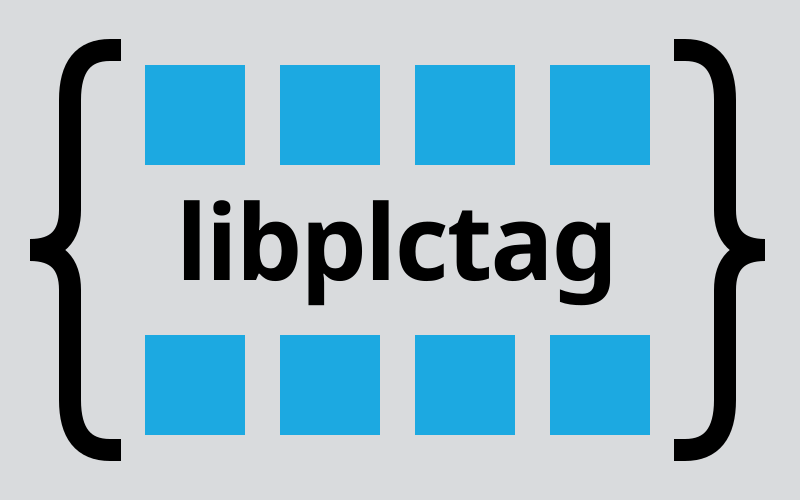

# libplctag - PLC Communication Library

libplctag is an open-source C library for reading and writing tags in PLCs using EtherNet/IP and Modbus TCP. Available for Linux, Windows, and macOS, it's been in production use since 2012 across industries including manufacturing, radio astronomy, fitness equipment, and food handling.

Quick Links:
- [Download Latest Release](https://github.com/libplctag/libplctag/releases)
- [Documentation & Wiki](https://github.com/libplctag/libplctag/wiki)
- [Source Code](https://github.com/libplctag/libplctag)
- [Forum](https://groups.google.com/forum/#!forum/libplctag)
- [Language Wrappers](#wrappers)

## WARNING - DISCLAIMER

PLCs control equipment where loss of property, production, or life can occur from programming mistakes. Always exercise caution when accessing or programming PLCs!

We make no claims or warranties about the suitability of this code for any purpose.

## Key Features

- EtherNet/IP and Modbus TCP support
- Multi-platform: Linux, Windows, macOS (x86, x86-64, ARM, MIPS)
- Multi-language: C core with wrappers for C#/.Net, Java, Julia, Go, Python, and more
- Stable API with minimal breaking changes since 2012
- High performance with low memory footprint
- Free and open source (dual licensed: MPL 2.0 or LGPL 2+)

## PLC Support

- Rockwell/Allen-Bradley: ControlLogix, CompactLogix, Micro 800/850, MicroLogix, SLC 500, PLC-5
- Omron: NX/NJ series PLCs
- Modbus TCP devices

For detailed feature lists, see the [full README](https://github.com/libplctag/libplctag#features).

## Tier One Platforms

These are OS/compiler combinations that are fully tested with each release:

| **OS**       | **OS Version** | **Compiler**    | **Compiler Version** | **Architecture** | **Status** |
|    :-:       |    :-:         |    :-:          |    :-:               |        :-:       | :-         |
| Alpine Linux | v3.23.0-62     | GCC             | 15.2.0               | x86-64           |  |
| Alpine Linux | v3.23.0-62     | GCC             | 15.2.0               | Aarch64          |  |
| macOS        | 14             | Apple-Clang     | 17.0.0               | x86-64           |  |
| macOS        | 15             | Apple-Clang     | 17.0.0               | Aarch64          |  |
| Ubuntu Linux | 24.04          | GCC             | 13.3.0               | x86-64           |  |
| Ubuntu Linux | 24.04          | GCC-musl        | 13.3.0               | x86-64           |  |
| Ubuntu Linux | 24.04          | GCC             | 13.3.0               | Aarch64          |  |
| Ubuntu Linux | 24.04          | GCC             | 13.3.0               | x86              |  |
| Windows      | 11 (Server 22) | MSVC            | 19.44.35221.0        | x86-64           |  |
| Windows      | 11 (Server 22) | MSVC            | 19.44.35221.0        | x86              |  |
| Windows      | 11 (Server 22) | MSVC            | 19.44.35221.0        | Aarch64          |  |
| Windows      | 11 (Server 22) | MinGW-GCC.      | 14.2.0               | x86-64           |  |

## Getting Started

1. [Download pre-built binaries](https://github.com/libplctag/libplctag/releases) for your platform
2. Explore [example code](https://github.com/libplctag/libplctag/tree/release/src/examples), starting with [simple.c](https://github.com/libplctag/libplctag/blob/release/src/examples/simple.c)
3. Read the [API documentation](https://github.com/libplctag/libplctag/wiki/API) on the wiki
4. [Build from source](https://github.com/libplctag/libplctag) for your specific needs

## Language Wrappers {#wrappers}

The C core library is designed for easy wrapping in other languages:

Official projects in the libplctag organization:
- [libplctag.NET](https://github.com/libplctag/libplctag.NET) - C#/.Net (very popular!)
- [libplctag4j](https://github.com/libplctag/libplctag4j) - Java and Android
- [PLCTag.jl](https://github.com/libplctag/PLCTag.jl) - Julia
- [goplctag](https://github.com/libplctag/goplctag) - Go

Included with the C library:
- C++, Python, Pascal

Community wrappers:
- Additional C# implementations and LabVIEW support available on GitHub

## Contributing

We welcome contributions including bug reports, fixes, new protocols, platforms, language wrappers, and testing. See [how to contribute](https://github.com/libplctag/libplctag#how-to-contribute) in the main repository.

## Support & Community

- [libplctag Forum](https://groups.google.com/forum/#!forum/libplctag) - General questions and discussions
- [GitHub Issues](https://github.com/libplctag/libplctag/issues) - Bug reports and feature requests
- [Wiki History Page](https://github.com/libplctag/libplctag/wiki/History) - Learn how libplctag was created
- [Sponsor on GitHub](https://github.com/sponsors/libplctag) - Support the project

## License

Dual licensed under Mozilla Public License 2.0 (MPL 2.0) or GNU Lesser General Public License 2+ (LGPL 2+). See the main repository for license details.

---

For complete documentation, visit the [libplctag wiki](https://github.com/libplctag/libplctag/wiki) and [main repository](https://github.com/libplctag/libplctag).
